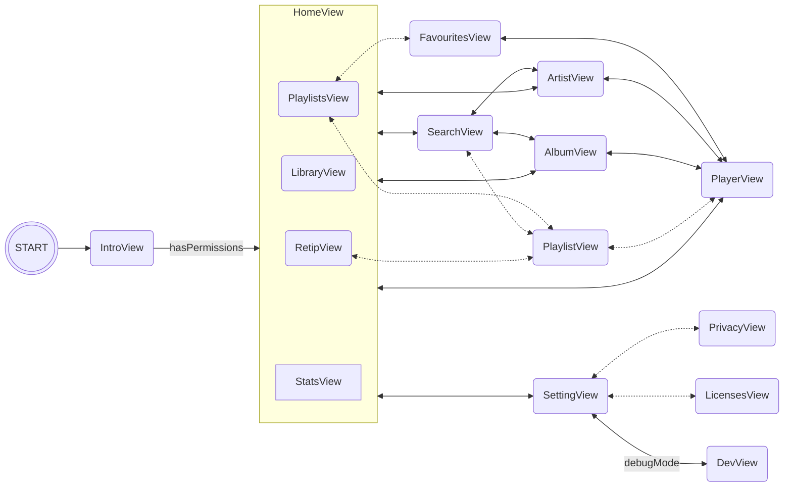

# Retip App Routes

```mermaid
flowchart LR;
    start(((START)))
    intro(IntroView)
    player(PlayerView)
    settings(SettingView)
    dev(DevView)
    search(SearchView)

    artist(ArtistView)
    album(AlbumView)
    playlist(PlaylistView)
    favourites(FavouritesView)

    licenses(LicensesView)
    privacy(PrivacyView)

    subgraph home [HomeView]
        retip(RetipView)
        library(LibraryView)
        playlists(PlaylistsView)
        stats[StatsView]
    end

    start --> intro
    intro -- hasPermissions --> home
    home <---> player
    home <---> settings

    home <--> album
    home <--> artist
    home <--> search
    playlists <-.-> playlist
    playlists <-.-> favourites
    favourites <--> player

    artist <--> player
    album <--> player
    playlist <-.-> player

    search <--> artist
    search <--> album
    search <-.-> playlist
    retip <-.-> playlist


    settings <-.-> privacy
    settings <-.-> licenses

    settings <-- debugMode --> dev
```